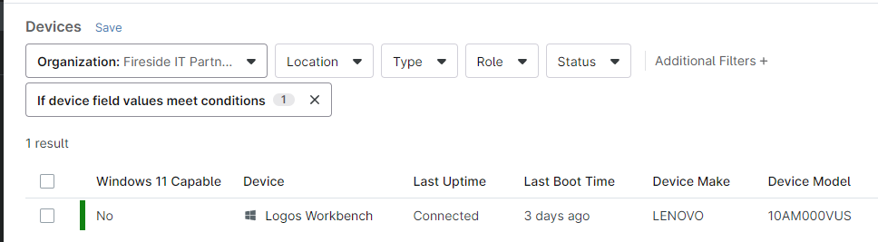
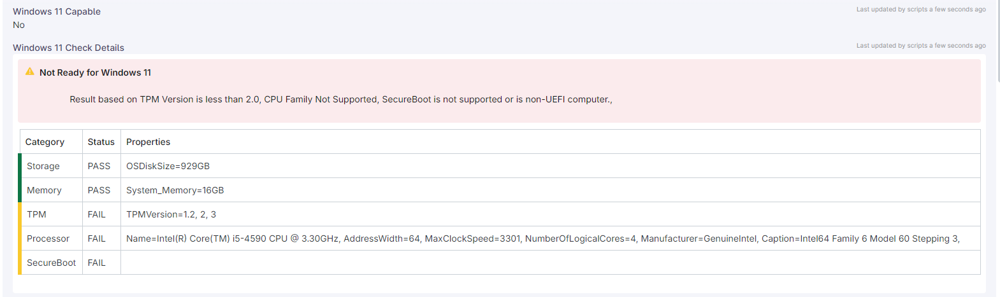

# Get Windows 11 Compatibility to Ninja Custom Fields  

This script will check the target computer for Windows 11 Compatibility and update the configured Custom Fields in Ninja.  

You will need to create a WYSIWYG customfield for the details, and a checkbox custom field for the boolean flag.  

## Checkbox Custom Field

Create a "checkbox" role custom field in Ninja and assign it to the roles for desktops and laptops.  
Once the script is run you can add this CF to the device table, include it in device list exports, or filter by it.

## WYSIWYG Custom Field  

Create a "WYSIWYG" role custom field in Ninja and assign it to the roles for desktops and laptops.  
  

I suggest adding this to device policy to run automatically.  Unless a system is replaced the details shouldn't change, so decide run frequency for your environment.
